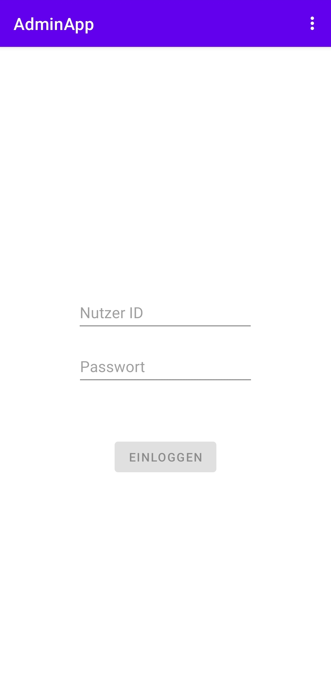
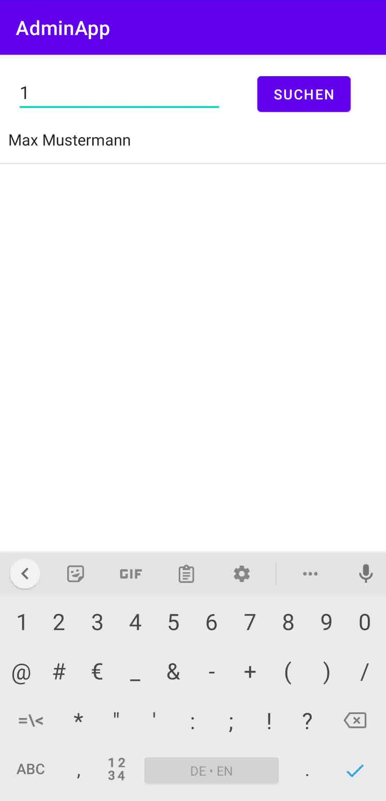
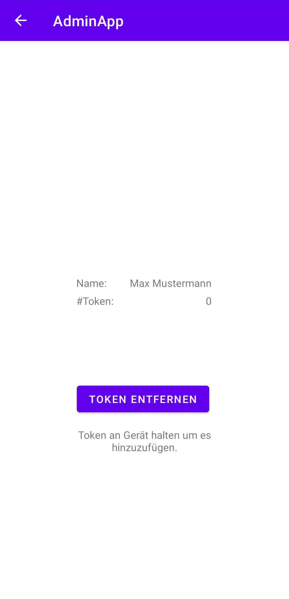
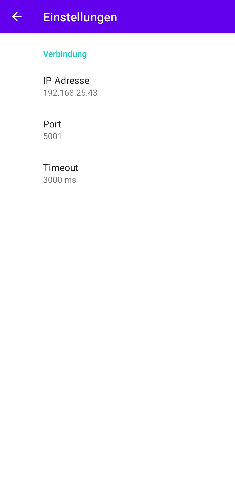

# 🚪 Admin App
 
   
 
 ## 📌 About the Project
 
 The **Admin NFC Door Access App** is an Android application written in **Java** that serves as an admin tool for managing **NFC-based door access control**. The app is part of a larger project that enables employees to open a **secured door** via **NFC chips, keys, or a web interface**.
 
 The app allows administrators to **manage employee access tokens** by registering or removing NFC chips linked to employees. This ensures seamless door access while maintaining **security and flexibility**.
 
 📂 **This repository only contains the admin app.**  
 🔗 **For the full project (including Raspberry Pi integration, doorbell, camera, and web access), visit:**  
 👉 [**IoT Door Control System**](https://github.com/Gostdragon/IoT-Door-Control-System)
 
 ---
 
 ## 📱 Features
 
 - 🔑 **Secure Login**: Admins must log in with a **username and password** before accessing the app.
 - 🔍 **Search Employees**: Quickly find employees by searching their username.
 - 🎮 **Manage NFC Tokens**:  
   - **Add new NFC chips** by scanning them with a smartphone.  
   - **Remove tokens** assigned to employees.
 - ⚙️ **Configurable Settings**: Modify:
   - Server **IP address & port**  
   - **Timeout duration** for server responses  
 - 🔗 **Seamless Integration**: The app connects to a central **server** where employee and token data are stored.
 
 ---
 
 ## 🛠️ How It Works
 
 1. **Login**: The admin logs into the app using valid credentials.
 2. **Search Employees**: Admin enters an employee’s name to retrieve a list of matching employees.
 3. **Manage Tokens**:
    - Select an employee to view their registered NFC tokens.
    - **Add new NFC token** by scanning the chip.
    - **Delete existing tokens** when necessary.
 4. **Adjust Settings**: Configure **server IP, port, and timeout settings** as needed.
 
 ---
 
 ## 📷 Screenshots
 
 | Login Screen | Employee Search | Add/Remove Tokens | Settings |
 |-------------|----------|----------------|-------------------|
 |  |  |  |  |
 
 ---
 
 ## 🏠 Project Background
 
 The **Admin NFC Door Access App** is part of a larger security system that integrates various **hardware components** connected to a **Raspberry Pi**:
 
 - 📱 **NFC Reader**: Scans NFC chips and verifies them with the server.
 - 🔔 **Doorbell & Speaker**: Alerts employees inside the building when visitors ring the bell.
 - 🔑 **Physical & Web-Based Access**: The door can be opened via:
   - An NFC chip (if registered)
   - A **physical button** inside the building
   - A **web interface**
 - 📷 **Camera Integration**: A live camera feed is displayed on the web interface, allowing employees to see visitors before granting access.
 
 For more details about the full project, check out:  
 🔗 **[IoT Door Control System](https://github.com/Gostdragon/IoT-Door-Control-System)**
 
 ---
 
 
 ## **Requirements**
 - **Android 11 (API Level 30)** device with **NFC support**
 - Internet access to communicate with the server